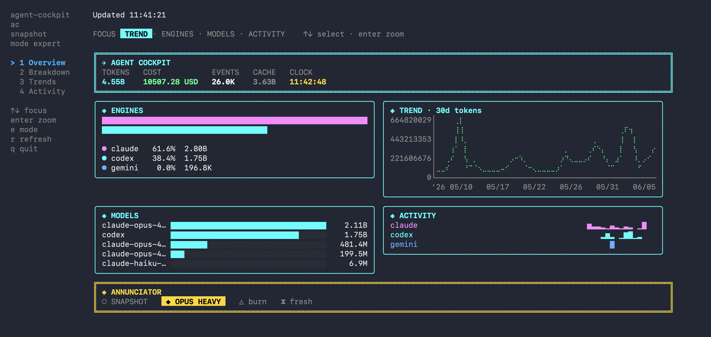

<div align="center">

# 🛩️ agent-cockpit

[](https://github.com/nashory/agent-cockpit/actions/workflows/ci.yml)
[](https://goreportcard.com/report/github.com/nashory/agent-cockpit)
[](go.mod)
[](LICENSE)


**A live terminal cockpit for token usage, cost, and speed across your coding agents.**

Claude Code, Codex, and Gemini burn tokens all day. `agent-cockpit` reads their
**local** logs and turns them into a glass-cockpit dashboard: token burn, USD
estimates, observed throughput, trends, and a GitHub-style year of activity.
No cloud upload. No API keys. No background daemon.

</div>

<p align="center">
  
</p>

---

## ✨ Why agent-cockpit?

- **🔒 Private by design.** It only reads log files already on your disk. Nothing
  is uploaded, no service runs in the background, no keys are required.
- **🛩️ One cockpit for every agent.** Claude Code, Codex, and Gemini in a single
  normalized view, so you can compare engines, models, and projects side by side.
- **💸 Know the cost.** Per-model pricing turns raw tokens into USD estimates,
  cache savings, effective `$/1M output`, and a daily burn rate.
- **⚡ Live.** `cockpit live` refreshes the instant an agent writes a log, via fsnotify
  (with a polling backstop).
- **🧰 Zero setup.** Sensible defaults discover your logs automatically; a config
  file is optional.

## 🎛️ Features

- **4 instrument tabs:** Overview, Breakdown, Trends, and Activity (including a
  GitHub-style year **contribution calendar**).
- **Derived insights:** cache hit rate, cache savings, input:output ratio,
  reasoning share, effective rate, output throughput (tokens/sec), usage
  velocity (day-over-day change), engaged hours, spending cadence, and streaks.
- **Focus and zoom:** move focus across widgets with the arrows, hit `enter` to
  blow one up fullscreen.
- **Expert and compact modes:** pack every instrument in, or keep it light.
- **Caution annunciators:** `HIGH BURN`, `OPUS HEAVY`, `STALE`, `LIVE` lamps.
- **Static reports and statusline:** pipeable output for scripts, tmux, and CI.
- **Fast:** a cold scan of hundreds of logs parses in parallel across cores.
- **Single binary:** CGO-free, cross-platform, ~6 MB. The command is just `cockpit`.

## 🚀 Install

**Homebrew** (macOS & Linux):

```bash
brew install nashory/tap/agent-cockpit
cockpit
```

Or track `main` with `brew install --HEAD nashory/tap/agent-cockpit`.

**Windows** (no Homebrew). Grab the prebuilt binary from the
[latest release](https://github.com/nashory/agent-cockpit/releases/latest):
download `cockpit-<version>-windows-amd64.zip` (or `-arm64`), unzip it, and run
`cockpit.exe`. Add its folder to your `PATH` to call `cockpit` from any shell.

Or do the whole thing in PowerShell:

```powershell
$ver = (Invoke-RestMethod https://api.github.com/repos/nashory/agent-cockpit/releases/latest).tag_name
Invoke-WebRequest "https://github.com/nashory/agent-cockpit/releases/download/$ver/cockpit-$ver-windows-amd64.zip" -OutFile cockpit.zip
Expand-Archive cockpit.zip -DestinationPath . -Force
.\cockpit-$ver-windows-amd64\cockpit.exe
```

macOS/Linux users who skip Homebrew can grab the matching `.tar.gz` from the
same release page.

**With Go** (any platform, needs Go installed):

```bash
go install github.com/nashory/agent-cockpit/cmd/cockpit@latest
```

**From source:**

```bash
git clone https://github.com/nashory/agent-cockpit.git
cd agent-cockpit
make build && ./cockpit
```

## ⚡ Quick Start

```bash
cockpit                       # open the dashboard
cockpit live --refresh 2s     # live mode (refreshes on file changes)

# static, pipeable reports
cockpit today
cockpit trends --days 30
cockpit agents
cockpit speed
cockpit statusline            # one line for tmux / your shell prompt

# filter by source, project, or model
cockpit monthly --source claude
cockpit trends  --source claude,codex --project myrepo --days 30
cockpit agents  --model sonnet

# JSON for scripts
cockpit today --json

# config helpers
cockpit config init
cockpit doctor                # show detected log locations
```

## 🧭 Dashboards

Four tabs, each packed with instruments. Press `enter` to zoom any widget
fullscreen:

| Tab | Shows |
| --- | --- |
| **Overview** | headline token/cost readouts, per-agent bars, 30-day trend |
| **Breakdown** | engine share, model load, and output speed per lane |
| **Trends** | token / cost / throughput / velocity time-series plus efficiency, economics, and cadence (with engaged hours) |
| **Activity** | year contribution calendar, hour-of-day, day-of-week, projects |

<table>
  <tr>
    <td align="center"><br><sub><b>Breakdown</b></sub></td>
    <td align="center"><br><sub><b>Trends</b></sub></td>
    <td align="center"><br><sub><b>Activity</b></sub></td>
  </tr>
</table>

### Keys

| Key | Action |
| --- | --- |
| `1`-`4` | jump to a tab |
| `tab` / `shift+tab` | next / previous tab |
| arrows / `hjkl` | move widget focus |
| `enter` / `esc` | zoom the focused widget / exit zoom |
| `e` | toggle expert (dense) / compact (light) mode |
| `r` | refresh now |
| `q` | quit |

On **Activity**, zoom the calendar (`enter`) and then arrows move the day cursor
(left/right by week, up/down by day) with a tooltip for the selected day.

## 🔒 What It Reads

`agent-cockpit` reads **local log files only**. No network calls, ever.

| Agent | Default path |
| --- | --- |
| Claude Code | `~/.claude/projects/**/*.jsonl` |
| Codex | `~/.codex/sessions/**/*.jsonl`, `~/.codex/archived_sessions/**/*.jsonl` |
| Gemini | `~/.gemini/tmp/**/chats/session-*.json` |

## ⚙️ Configuration

Configuration is optional. To customize paths or pricing, create a config file:

| OS | Path |
| --- | --- |
| macOS / Linux | `~/.config/agent-cockpit/config.toml` |
| Windows | `%APPDATA%\agent-cockpit\config.toml` |

```toml
timezone = "local"
refresh_interval = "3s"
currency = "USD"

[paths]
claude = ["~/.claude/projects"]
codex  = ["~/.codex/sessions", "~/.codex/archived_sessions"]
gemini = ["~/.gemini/tmp"]

# Prices are USD per million tokens; keys match a model-name substring.
[pricing."claude-sonnet"]
input_per_million       = 3
output_per_million      = 15
cache_read_per_million  = 0.30
cache_write_per_million = 3.75
```

Run `cockpit config init` to drop a starter file in place.

## 🏗️ How It Works

Each adapter parses its agent's logs into a normalized `usage.Event`; events are
aggregated, priced, and rendered. Scanning runs in parallel across CPUs, live
mode is driven by an fsnotify watcher, and the TUI is built with
[Bubble Tea](https://github.com/charmbracelet/bubbletea).

```text
cmd/cockpit/                 entry point (the `cockpit` binary)
internal/source/        Claude / Codex / Gemini log adapters
internal/scan/          parallel directory walk + file parsing
internal/watch/         fsnotify watcher for live refresh
internal/usage/         normalized events, pricing, aggregation, insights
internal/report/        static terminal reports
internal/tui/           Bubble Tea glass-cockpit dashboard
```

See [docs/architecture.md](docs/architecture.md) for the full design.

## 🖥️ Platforms

Ships as a CGO-free native binary:

| OS | Architectures |
| --- | --- |
| macOS | Apple Silicon, Intel |
| Linux | amd64, arm64 |
| Windows | amd64, arm64 |

## 🛠️ Development

```bash
make ci        # gofmt + go vet + full test suite (mirrors GitHub CI)
make test      # go test ./...
make race      # go test -race ./...
make build     # build ./cockpit
make run       # go run ./cmd/cockpit
```

Contributions are welcome. See [CONTRIBUTING.md](CONTRIBUTING.md),
[SECURITY.md](SECURITY.md), and [docs/](docs/).

## 📄 License

[Apache-2.0](LICENSE) © agent-cockpit contributors.

## 🙌 Acknowledgements

Built with [Bubble Tea](https://github.com/charmbracelet/bubbletea),
[Lip Gloss](https://github.com/charmbracelet/lipgloss),
[ntcharts](https://github.com/NimbleMarkets/ntcharts),
[Cobra](https://github.com/spf13/cobra), and
[fsnotify](https://github.com/fsnotify/fsnotify).
