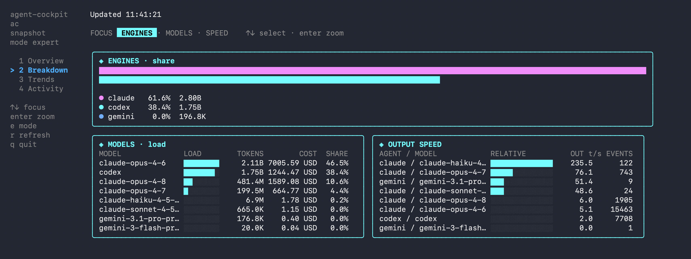
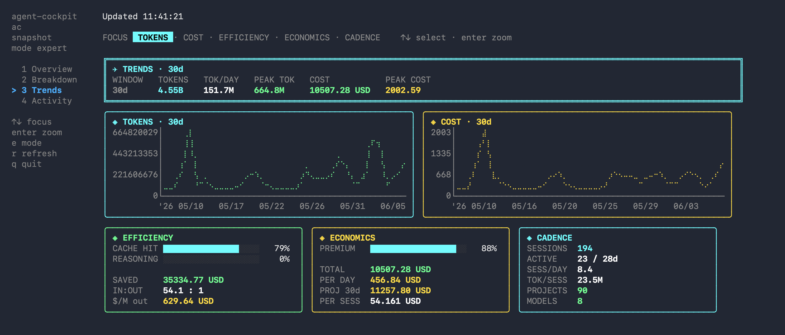
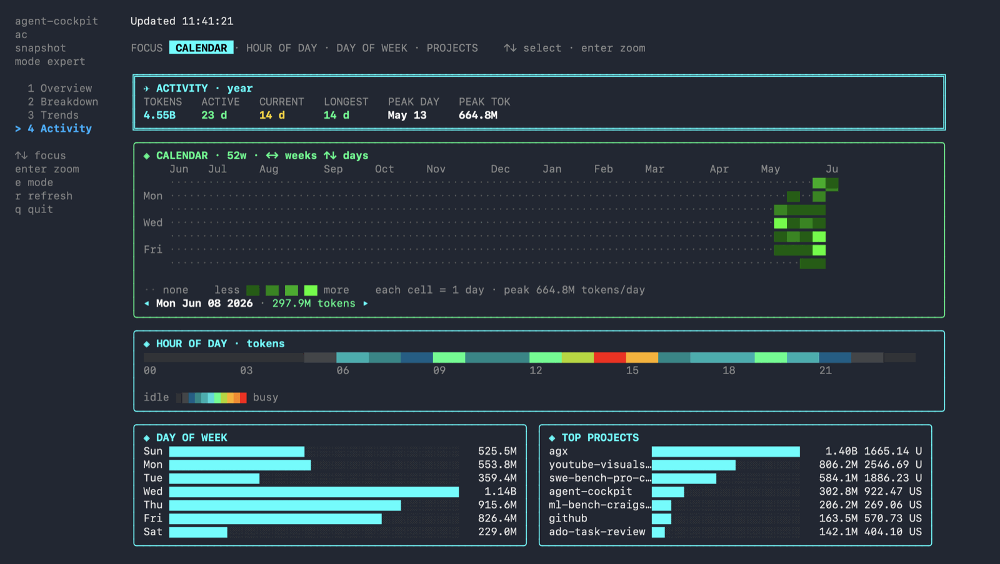

<div align="center">

# 🛩️ agent-cockpit

[](https://github.com/nashory/agent-cockpit/actions/workflows/ci.yml)
[](https://goreportcard.com/report/github.com/nashory/agent-cockpit)
[](go.mod)
[](LICENSE)


**A live terminal cockpit for token usage, cost, and speed across your coding agents.**

Claude Code, Codex, Gemini, OpenCode, Amp, and Copilot burn tokens all day. `agent-cockpit` reads their
**local** logs and turns them into a glass-cockpit dashboard: token burn, USD
estimates, observed throughput, trends, and a GitHub-style year of activity.
No cloud upload. No API keys. No background daemon.

</div>

<p align="center">
  
</p>

---

## ✨ Why agent-cockpit?

- **🔒 Private by design.** It only reads log files already on your disk. Nothing
  is uploaded, no service runs in the background, no keys are required.
- **🛩️ One cockpit for every agent.** Claude Code, Codex, Gemini, OpenCode, Amp, and Copilot in a single
  normalized view, so you can compare engines, models, and projects side by side.
- **💸 Know the cost.** Per-model pricing (derived from the
  [LiteLLM](https://github.com/BerriAI/litellm) dataset and vendored into the
  binary, so it stays accurate with zero network calls) turns raw tokens into USD
  estimates, cache savings, effective `$/1M output`, and a daily burn rate.
- **⚡ Live.** `cockpit live` refreshes the instant an agent writes a log, via fsnotify
  (with a polling backstop).
- **🧰 Zero setup.** Sensible defaults discover your logs automatically; a config
  file is optional.
- **📦 No runtime to install.** One static binary. No Node, no Bun, no `npx` /
  `bunx`, no Python. `brew install` and run `cockpit`.

## 🚀 Install

**Homebrew** (macOS & Linux):

```bash
brew install nashory/tap/agent-cockpit
cockpit
```

Or track `main` with `brew install --HEAD nashory/tap/agent-cockpit`.

**Windows** (no Homebrew). Grab the prebuilt binary from the
[latest release](https://github.com/nashory/agent-cockpit/releases/latest):
download `cockpit-<version>-windows-amd64.zip` (or `-arm64`), unzip it, and run
`cockpit.exe`. Add its folder to your `PATH` to call `cockpit` from any shell.

Or do the whole thing in PowerShell:

```powershell
$ver = (Invoke-RestMethod https://api.github.com/repos/nashory/agent-cockpit/releases/latest).tag_name
Invoke-WebRequest "https://github.com/nashory/agent-cockpit/releases/download/$ver/cockpit-$ver-windows-amd64.zip" -OutFile cockpit.zip
Expand-Archive cockpit.zip -DestinationPath . -Force
.\cockpit-$ver-windows-amd64\cockpit.exe
```

macOS/Linux users who skip Homebrew can grab the matching `.tar.gz` from the
same release page.

**With Go** (any platform, needs Go installed):

```bash
go install github.com/nashory/agent-cockpit/cmd/cockpit@latest
```

**From source:**

```bash
git clone https://github.com/nashory/agent-cockpit.git
cd agent-cockpit
make build && ./cockpit
```

## ⚡ Quick Start

```bash
cockpit                       # open the dashboard
cockpit live --refresh 2s     # live mode (refreshes on file changes)

# static, pipeable reports
cockpit today
cockpit trends --days 30
cockpit agents
cockpit speed
cockpit statusline --compact  # one line for tmux / your shell prompt
cockpit statusline --json     # structured statusline payload
cockpit statusline --format '{{model}} {{context}} {{today_cost}}'
cockpit serve --addr 127.0.0.1:8765  # localhost JSON API
cockpit report                # text summary (add --json for JSON)
cockpit report --svg usage.svg  # shareable SVG receipt card
cockpit export --group daily > usage.csv  # CSV: daily/session/model/project/event
cockpit pricing status        # show vendored pricing coverage

# filter by source, project, or model
cockpit monthly --source claude
cockpit trends  --source claude,codex --project myrepo --days 30
cockpit trends  --since 7d --until 2026-06-11
cockpit agents  --model sonnet
cockpit today --timezone Europe/Zurich
cockpit export --group daily --order asc
cockpit report --breakdown project

# JSON for scripts
cockpit today --json
cockpit today --json --no-cost  # omit estimated cost fields

# config helpers
cockpit config init
cockpit config schema            # print config JSON schema
cockpit config validate          # validate config.toml
cockpit doctor                # show detected log locations
```

See [ccusage Workflow Mapping](docs/ccusage-workflows.md) for common command
translations, and [Integrations](docs/integrations.md) for tmux, Waybar, and
localhost API examples.

## 🎛️ Features

- 🛩️ **Live TUI:** a glass-cockpit dashboard that refreshes the instant an agent writes a log.
- 📊 **Daily / Trends:** token usage and cost over time, as tables and braille charts.
- ⏱️ **Blocks:** Claude's 5-hour billing windows with a live burn-rate projection.
- 🤖 **Unified view:** Claude Code, Codex, Gemini, OpenCode, Amp, and Copilot usage in one normalized cockpit.
- 💸 **Accurate cost:** per-model pricing from the LiteLLM dataset, vendored for offline use.
- 🧮 **Insights:** cache hit rate, throughput, velocity, engaged hours, and caution lamps.
- 🚦 **Budgets & limits:** optional daily / weekly / monthly USD budgets and Claude 5h / 7d token limits, surfaced in the TUI and statusline.
- 🔒 **100% local:** read-only, no upload, no API keys, no daemon.
- 📦 **No runtime:** one static Go binary. No Node, Bun, `npx`, or Python.
- 🧰 **Scriptable:** `today` / `weekly` / `monthly` / `trends` / `statusline`, JSON output, and CSV export.
- 🖼️ **Shareable SVG:** `cockpit report --svg` renders a receipt card you can post anywhere.

## 🧭 Dashboards

Seven tabs, each packed with instruments. Press `enter` to zoom any widget
fullscreen:

| Tab | Shows |
| --- | --- |
| **Overview** | headline token/cost readouts, per-agent bars, 30-day trend |
| **Breakdown** | engine share, model load, and output speed per lane |
| **Trends** | token / cost / throughput / velocity time-series plus efficiency, economics, and cadence (with engaged hours) |
| **Activity** | year contribution calendar, hour-of-day, day-of-week, projects |
| **Daily** | a ccusage-style ledger with day / week / month periods: input / output / cache / total tokens, cost, and models, newest first with a grand total |
| **Blocks** | 5-hour activity/billing windows: a live ACTIVE WINDOW with elapsed/remaining, burn rate, cost projection, and optional configured-limit usage |
| **Sessions** | a per-session table — project, engine, start, active span, tokens, cost, and models — so you can see which sessions cost the most |

<table>
  <tr>
    <td align="center"><br><sub><b>Breakdown</b></sub></td>
    <td align="center"><br><sub><b>Trends</b></sub></td>
    <td align="center"><br><sub><b>Activity</b></sub></td>
  </tr>
</table>

### Keys

| Key | Action |
| --- | --- |
| `1`-`7` | jump to a tab |
| `tab` / `shift+tab` | next / previous tab |
| arrows / `hjkl` | move widget focus |
| `enter` / `esc` | zoom the focused widget / exit zoom |
| `e` | toggle expert (dense) / compact (light) mode |
| `w` | cycle the chart window (7 / 30 / 90 days) |
| `p` | cycle the Daily ledger period (day / week / month) |
| `s` | sort the Daily / Blocks / Sessions table (date / tokens / cost) |
| `r` | refresh now |
| `?` | toggle the full keyboard help |
| `q` | quit |

Your last `e` / `w` / `s` choices are remembered across runs (saved to
`ui.json` next to the config). The palette adapts to the terminal: it honors
[`NO_COLOR`](https://no-color.org) and switches to a higher-contrast ink set on
light backgrounds.

On **Activity**, zoom the calendar (`enter`) and then arrows move the day cursor
(left/right by week, up/down by day) with a tooltip for the selected day. Zoom
**Top Projects** and arrows select a project; `enter` opens a project drill-down.
On
**Daily**, **Blocks**, and **Sessions**, arrows move a row cursor (the view
follows it) and `enter` opens that row's per-model breakdown (`esc` closes it).

Costs are estimates derived from token counts (no per-call cost is recorded in
the logs), so every USD figure is shown with a leading `~`. Add `--no-cost` to
CLI reports, statusline output, or CSV exports when you only want token counts.

## 🔒 What It Reads

`agent-cockpit` reads **local log files only**. No network calls, ever.

| Agent | Default path |
| --- | --- |
| Claude Code | `~/.claude/projects/**/*.jsonl` |
| Codex | `~/.codex/sessions/**/*.jsonl`, `~/.codex/archived_sessions/**/*.jsonl` |
| Gemini | `~/.gemini/tmp/**/chats/session-*.json` |
| OpenCode | `~/.local/share/opencode/opencode*.db`, `~/.local/share/opencode/storage/message/*.json`, `~/.opencode/opencode*.db` |
| Amp | `~/.local/share/amp/threads/**/*.json` |
| GitHub Copilot CLI | `~/.copilot/otel/**/*.jsonl`, plus `COPILOT_OTEL_FILE_EXPORTER_PATH` |

## ⚙️ Configuration

Configuration is optional. To customize paths or pricing, create a config file:

| OS | Path |
| --- | --- |
| macOS / Linux | `~/.config/agent-cockpit/config.toml` |
| Windows | `%APPDATA%\agent-cockpit\config.toml` |

```toml
timezone = "local"
refresh_interval = "3s"
currency = "USD"

[budget]
# Optional USD budgets. When set, the TUI LIMITS panel and statusline show
# ok / warn / critical state for each period.
# daily_usd = 25
# weekly_usd = 100
# monthly_usd = 300
# warn_pct = 80
# critical_pct = 95

[limits]
# Optional Claude Code token limits for local quota-style monitoring.
# claude_5h_tokens = 88000
# claude_7d_tokens = 500000
# warn_pct = 80
# critical_pct = 95

[paths]
claude = ["~/.claude/projects"]
codex  = ["~/.codex/sessions", "~/.codex/archived_sessions"]
gemini = ["~/.gemini/tmp"]
opencode = ["~/.local/share/opencode", "~/.opencode"]
amp = ["~/.local/share/amp"]
copilot = ["~/.copilot/otel"]

# Defaults come from the vendored LiteLLM table; override here only if you want
# to. Prices are USD per million tokens; keys match a model-name substring.
[pricing."claude-sonnet"]
input_per_million       = 3
output_per_million      = 15
cache_read_per_million  = 0.30
cache_write_per_million = 3.75
```

Run `cockpit config init` to drop a starter file in place.

Use `cockpit config schema` for editor integration or automation that needs the
JSON Schema for `config.toml`. Use `cockpit config validate` before committing
to a local setup change; add `--json` for machine-readable validation output.

## 🏗️ How It Works

Each adapter parses its agent's logs into a normalized `usage.Event`; events are
aggregated, priced, and rendered. Scanning runs in parallel across CPUs, live
mode is driven by an fsnotify watcher, and the TUI is built with
[Bubble Tea](https://github.com/charmbracelet/bubbletea).

```text
cmd/cockpit/                 entry point (the `cockpit` binary)
internal/source/        Claude / Codex / Gemini / OpenCode / Amp / Copilot log adapters
internal/scan/          parallel directory walk + file parsing
internal/watch/         fsnotify watcher for live refresh
internal/usage/         normalized events, pricing, aggregation, insights
internal/report/        static terminal reports
internal/tui/           Bubble Tea glass-cockpit dashboard
```

See [docs/architecture.md](docs/architecture.md) for the full design.

## 🖥️ Platforms

Ships as a CGO-free native binary:

| OS | Architectures |
| --- | --- |
| macOS | Apple Silicon, Intel |
| Linux | amd64, arm64 |
| Windows | amd64, arm64 |

## 🛠️ Development

```bash
make ci        # gofmt + go vet + full test suite (mirrors GitHub CI)
make test      # go test ./...
make race      # go test -race ./...
make build     # build ./cockpit
make run       # go run ./cmd/cockpit
```

Contributions are welcome. See [CONTRIBUTING.md](CONTRIBUTING.md),
[SECURITY.md](SECURITY.md), and [docs/](docs/).

## 📄 License

[Apache-2.0](LICENSE) © agent-cockpit contributors.

## 🙌 Acknowledgements

Built with [Bubble Tea](https://github.com/charmbracelet/bubbletea),
[Lip Gloss](https://github.com/charmbracelet/lipgloss),
[ntcharts](https://github.com/NimbleMarkets/ntcharts),
[Cobra](https://github.com/spf13/cobra), and
[fsnotify](https://github.com/fsnotify/fsnotify).
